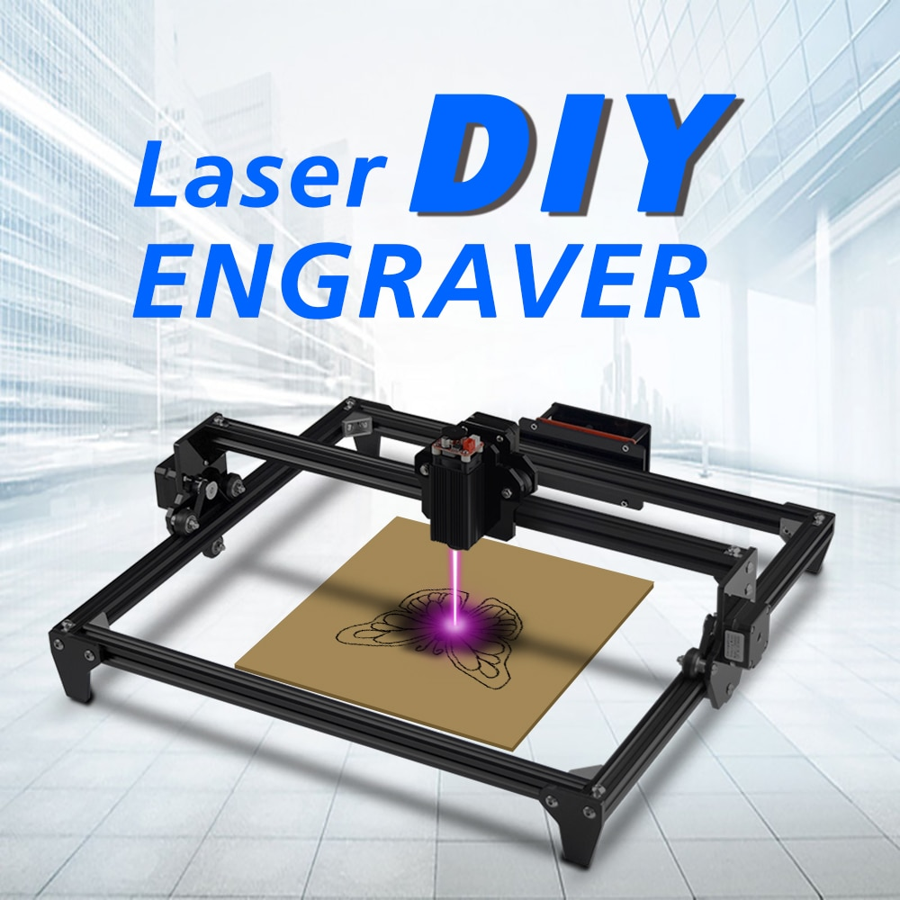

# python_GRBL
Pythonic wrapper for GRBL control.

Tested on GRBL v1.1f

Hardware Tested:



*New* 2019! CNC6030 Support!


# Usage & Examples

## Save & Load settings.

Useful for migrating configs between machines/arduino devices.

- Dump GRBL machine settings to stdout.

    grblcli print_settings
    
- Save GRBL machine settings to a file.

    grblcli print_settings > machine.config
    
- Load GRBL machine settings from a file.

    grbl_cli load_settings machine.config
    
# Aim the laser.

Useful for aiming the laser.

```
grblcli aimlaser
```

Will prompt you to start and stop aiming the laser.

```
    Press Enter to start aiming laser.
	Press Enter to stop aiming laser.
```

# Run a g-code file.

Stream a G-code file to the GRBL device. 

    grblcli run drawing.ngc
    
## Bash Completion

https://click.palletsprojects.com/en/7.x/bashcomplete/

    eval "$(_GRBLCLI_COMPLETE=source `which grblcli`)"
    

# Installation

Through pip:

    pip install git+https://github.com/jed-frey/python_GRBL.git
